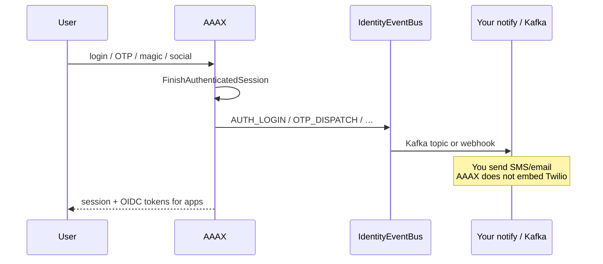

# AAAX

**Accounts · Authentication · Authorization · eXperiences**

### Identity you run. Signals you own.

Self-host **OIDC** for **Spring / platform teams** — without SaaS seat tax, without Keycloak weight, without private Maven.

**Primary win:** [Identity Event Bus](./docs/IDENTITY_EVENTS.md)  
→ login · MFA · OTP · clients as CloudEvents → **your** Kafka / webhook / notification-service  
→ **you keep SMS** (no Twilio lock-in)

```text
clone → mvn test → spring-boot:run → token
                 ↘ events → your notify mesh
```



> **ICP:** JVM teams that already run (or want) Kafka + notification-service and need a lean OIDC issuer.  
> Not a Clerk SaaS clone — see [Clerk parity (honest)](./docs/CLERK_PARITY.md).

[](./LICENSE)
[](./pom.xml)
[](./pom.xml)
[](https://github.com/yky32/aaax/releases/tag/v0.5.0)

| | |
|--|--|
| **Docs** | [Booklet](./docs/AAAX_BOOKLET.md) · [Core](./docs/CORE.md) · [QR login](./docs/QR_LOGIN.md) · [Trusted devices](./docs/TRUSTED_DEVICES.md) · [Roadmap](./docs/ROADMAP.md) · [Changelog](./CHANGELOG.md) |
| **Examples** | [examples/](./examples/) · [Kafka notify](./examples/compose-kafka-notify/) · [**Resource server**](./examples/resource-server-boot4/) · [Redis OTP](./examples/redis-otp-store.md) |
| **Version** | **`v0.5.0`** (Boot 4.1 / JDK 21) |
| **Maven** | Central + Shibboleth OpenSAML (public) — no private packages |

---

## 5-minute path

**Need:** JDK **21**+, Maven 3.9+

```bash
git clone https://github.com/yky32/aaax.git
cd aaax
git checkout v0.5.0   # or main
mvn test
mvn spring-boot:run
```

**Reading the code (OSS tour):** [docs/CODEMAP.md](./docs/CODEMAP.md) — SecurityConfig → login use cases → Event Bus.

**Another terminal:**

```bash
curl -sS http://localhost:8081/actuator/health
./examples/curl/get-token-and-hello.sh
./examples/curl/login-admin-and-events.sh
```

**Docker (Postgres):**

```bash
mvn -DskipTests package
docker compose up --build
```

**Production-shaped path (AAAX + Kafka + sample notify consumer):**

```bash
cd examples/compose-kafka-notify
docker compose up --build
# see README in that folder
```

---

## What v0.5.0 commits to

| ✅ Supported | 🧪 Opt-in | ❌ Out of 0.5 |
|--------------|-----------------|---------------|
| OIDC AS (discover / JWKS / code / refresh / client_credentials) | Passkeys (**off** default; `AAAX_PASSKEYS_ENABLED=true` → webauthn4j verify) | Multi-tenant orgs |
| Accounts · password · OTP · magic link | — | SAML IdP |
| TOTP MFA · sessions list/revoke | — | Official React SDK |
| Identity Event Bus (log · audit · buffer · Kafka · webhook) | — | LDAP |
| Admin `/admin/` · users/clients | — | |
| Hosted `/sign-in/` `/sign-up/` `/user/` | — | |
| Social Google + GitHub (optional) | — | |
| SAML SP (optional) | — | |
| SMS via **kafka event** or **webhook** (your provider) | — | |

---

## Hosted UI (same jar)

```text
/sign-in/   password · magic · OTP · social
/sign-up/
/user/      profile · sessions · passkeys (if enabled)
/admin/     ops console (admin / admin12345 demo)
```

---

## OTP / SMS (no carrier SDK)

| `AAAX_OTP_CHANNEL` | Behavior |
|--------------------|----------|
| `console` | Log codes (default) |
| `mail` | SMTP |
| `kafka` | Event for **your** notification-service |
| `sms` | HTTP webhook to **your** SMS adapter |

Lifecycle events: `AAAX_EVENTS_KAFKA_ENABLED=true` → topic `aaax.identity.events`.

---

## Social (optional)

```bash
export SPRING_PROFILES_ACTIVE=social
export GOOGLE_CLIENT_ID=...
export GOOGLE_CLIENT_SECRET=...
# optional GitHub — see docs/SOCIAL.md
```

---

## Demo credentials (local seeds only)

| | |
|--|--|
| User | `demo` / `demo1234` |
| Admin | `admin` / `admin12345` |
| OAuth client | `aaax-demo` / `aaax-demo-secret` |

Prod: `SPRING_PROFILES_ACTIVE=prod` or `AAAX_DEMO_SEED_*=false`.

---

## License

Apache-2.0
