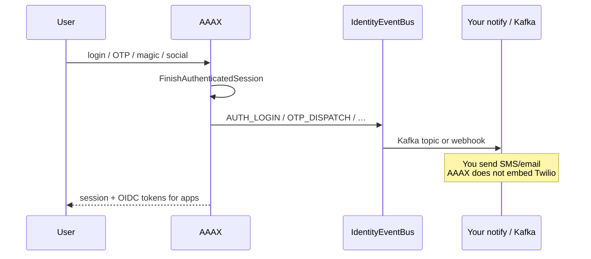

# AAAX

**Accounts · Authentication · Authorization · eXperiences**

### Identity you run. Signals you own.

Self-host **OIDC** for **Spring / platform teams** — without SaaS seat tax, without Keycloak weight, without private Maven.

**Primary win:** [Identity Event Bus](./docs/booklet.md#15-identity-event-bus)  
→ login · MFA · OTP · clients as CloudEvents → **your** Kafka / webhook / notification-service  
→ **you keep SMS** (no Twilio lock-in)

```text
clone → mvn test → spring-boot:run → token
                 ↘ events → your notify mesh
```



> **ICP:** JVM teams that already run (or want) Kafka + notification-service and need a lean OIDC issuer.  
> Not a Clerk SaaS clone — see [Clerk parity (honest)](./docs/booklet.md#24-clerk--qs-uaa-parity-honest).

[](./LICENSE)
[](./pom.xml)
[](./pom.xml)
[](https://github.com/yky32/aaax/releases/tag/v0.7.0)
[](https://github.com/yky32/aaax/actions)

| | |
|--|--|
| **Site** | **https://aaax-www.vercel.app/** · [yky32/aaax-www](https://github.com/yky32/aaax-www) |
| **MCP Auth** | **[MCP Auth Index](./docs/mcp-auth-index.md)** — OIDC AS for MCP resource servers · [web](https://aaax-www.vercel.app/mcp-auth) |
| **Docs** | **[Booklet](./docs/booklet.md)** (single SoT) · [Changelog](./CHANGELOG.md) · [Contributing](./CONTRIBUTING.md) |
| **Layout** | **Layer-first** — `endpoint/` · `usecase/` · `entity/po|dto|model` · `repository/` · `spi/` ([§7](./docs/booklet.md#7-architecture)) |
| **Examples** | [**Mesh**](./examples/compose-mesh/) · [**SPA PKCE**](./examples/spa-pkce/) · [examples/](./examples/) · [Resource server](./examples/resource-server-boot4/) |
| **Version** | **`v0.7.0`** (Boot 4.1 / JDK 21) |
| **Maven** | Central + Shibboleth OpenSAML (public) — no private packages |

---

## MCP Auth (agents / Cursor / remote tools)

MCP servers are **OAuth Resource Servers**. Clients need an **Authorization Server**.

AAAX is a self-host **OIDC AS** (Spring Boot) you can point MCP PRM at:

→ **[MCP Auth Index](./docs/mcp-auth-index.md)** · https://aaax-www.vercel.app/mcp-auth

Honest scope: AS + JWKS + PKCE today; full MCP gateway / RFC 9728 host = later.

---

## 5-minute path

**Need:** JDK **21**+, Maven 3.9+

```bash
git clone https://github.com/yky32/aaax.git
cd aaax
git checkout v0.7.0   # or main
mvn test
mvn spring-boot:run
```

**Reading the code (OSS tour):** [Code map](./docs/booklet.md#8-code-map-clone-tour) — SecurityConfig → login use cases → Event Bus.  
**Conventions:** [Layering](./docs/booklet.md#7-architecture) — layer-first, qs/uaa neat (PO = JPA only, `*RequestDto` / `*ResponseDto`).

**Another terminal:**

```bash
curl -sS http://localhost:8081/actuator/health
./examples/curl/get-token-and-hello.sh
./examples/curl/login-admin-and-events.sh
```

**Docker (Postgres):**

```bash
mvn -DskipTests package
docker compose up --build
```

**Mesh golden path (Postgres + Redis OTP/QR + Kafka + HMAC webhook):**

```bash
mvn -DskipTests package
cd examples/compose-mesh && docker compose up --build
# login as demo/demo1234 → watch sample-notify + webhook sink logs
```

**SPA PKCE (thin browser client):**

```bash
# terminal 1: AAAX on :8081
# terminal 2:
cd examples/spa-pkce && python3 -m http.server 4173
# open http://127.0.0.1:4173/
```

---

## What v0.7.0 commits to

| ✅ Supported | 🧪 Opt-in | ❌ Out of 0.7 |
|--------------|----------------|---------------|
| OIDC AS (discover / JWKS / code / refresh / client_credentials) | Passkeys (**off** default; webauthn4j) | Multi-tenant orgs |
| Accounts · password · OTP · magic link · **QR login** | — | SAML IdP |
| TOTP MFA · **trusted devices** · sessions | — | Official React SDK |
| Identity Event Bus **catalog v1.0** · HMAC webhook · Kafka | — | LDAP |
| Admin `/admin/` · hosted sign-in/up/user | — | Full Clerk component kit |
| Social **7 providers** (Google · GitHub · Apple · Discord · GitLab · LINE · Slack) | — | Microsoft social |
| Redis OTP **and** QR store · SPA public client `aaax-spa` | — | |
| Layer-first packages · `AuditEntity` · `*RequestDto`/`*ResponseDto` | — | |
| SAML SP (optional) · SMS via kafka event or webhook | — | |

---

## Hosted UI (same jar)

```text
/sign-in/   password · magic · OTP · QR · social
/sign-up/
/user/      profile · sessions · devices · passkeys (if enabled)
/admin/     ops console (admin / admin12345 demo)
```

---

## OTP / SMS (no carrier SDK)

| `AAAX_OTP_CHANNEL` | Behavior |
|--------------------|----------|
| `console` | Log codes (default) |
| `mail` | SMTP |
| `kafka` | Event for **your** notification-service |
| `sms` | HTTP webhook to **your** SMS adapter |

Lifecycle events: `AAAX_EVENTS_KAFKA_ENABLED=true` → topic `aaax.identity.events`.  
Signed webhook: `AAAX_EVENTS_WEBHOOK_URL` + `AAAX_EVENTS_WEBHOOK_SECRET` → `X-AAAX-Signature: sha256=…`

---

## Social (optional)

Single `application.yml` — set env (no profile file). Empty client-id = off.

```bash
export GOOGLE_CLIENT_ID=...   GOOGLE_CLIENT_SECRET=...
export GITHUB_CLIENT_ID=...   GITHUB_CLIENT_SECRET=...
export APPLE_CLIENT_ID=...    APPLE_CLIENT_SECRET=...   # JWT you mint
export DISCORD_CLIENT_ID=...  DISCORD_CLIENT_SECRET=...
export GITLAB_CLIENT_ID=...   GITLAB_CLIENT_SECRET=...
export LINE_CHANNEL_ID=...    LINE_CHANNEL_SECRET=...
export SLACK_CLIENT_ID=...    SLACK_CLIENT_SECRET=...
# redirects: {AAAX_ISSUER}/login/oauth2/code/{registrationId}
```

Catalog + link/unlink: `GET /v1/auth/social/providers` · `/user/` · booklet §16.

---

## Demo credentials (local seeds only)

| | |
|--|--|
| User | `demo` / `demo1234` |
| Admin | `admin` / `admin12345` |
| Confidential client | `aaax-demo` / `aaax-demo-secret` |
| Public SPA | `aaax-spa` (PKCE, no secret) |

**Prod / Helm:** override env only (no Spring profile YAML):

```bash
AAAX_DEMO_SEED_CLIENT=false
AAAX_DEMO_SEED_ACCOUNT=false
JPA_DDL_AUTO=validate
SQL_INIT_MODE=never
# DB_URL / DB_USERNAME / DB_PASSWORD / AAAX_ISSUER / …
```

---

## License

Apache-2.0
